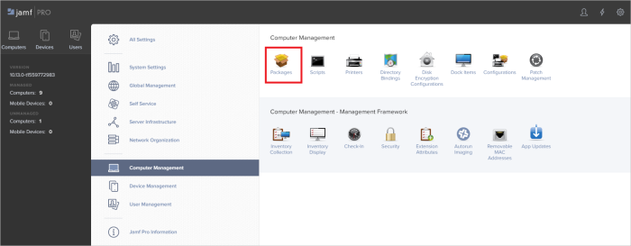
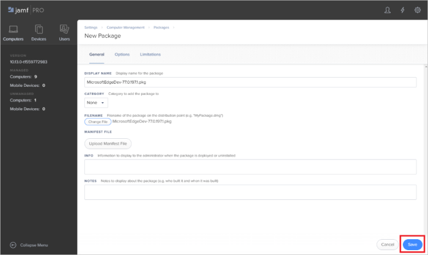
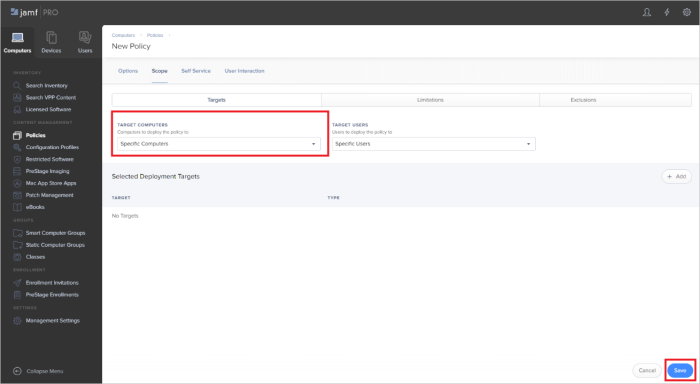

# Deploy to macOS

You can deploy Microsoft Edge for macOS using Microsoft Intune or Jamf.

>[!NOTE]
>This article applies to Microsoft Edge version 77 or later.

## Deploy Microsoft Edge for macOS using Microsoft Intune

You can deploy the Microsoft Edge .pkg installer as a line-of-business application using Microsoft Intune. This requires pre-processing the .pkg installer on a macOS device using the Intune App Wrapping Tool. The tool generates a .intunemac file that is uploaded to Microsoft Intune.

### Prerequisites

1. Download the [Intune App Wrapping Tool for macOS](https://github.com/msintuneappsdk/intune-app-wrapping-tool-mac). The tool must be run on a macOS device.

2. Mark the downloaded tool as an executable:

   - Start the Terminal app.
   - Change the directory to the location where `IntuneAppUtil` is located.
   - Run the following command to make the tool executable: 
     `chmod a+x ./IntuneAppUtil`
   - Test the tool by running:  
     `./IntuneAppUtil -h`

3. Use the `IntuneAppUtil` command to wrap the .pkg installer to a .intunemac file:  
   `./IntuneAppUtil -c MicrosoftEdgeDev-77.0.223.0.pkg -o <output_directory>`

To deploy Microsoft Edge for macOS using Microsoft Intune:

1. Sign in to [Intune](https://go.microsoft.com/fwlink/?linkid=2090973).
2. On the **Intune** pane, choose **Client apps** > **Apps** > **Add** > **Line-of-business app** > **App package file**.
3. On the **App package file** pane, choose the browse button, and select the wrapped Microsoft Edge installation file with the extension *.intunemac*. When you are finished, choose **OK**.
4. Configure app information. When you are finished, choose **OK**.
5. On the **Add app** pane, verify that the details for your app is correct.
6. Choose **Add**, to upload the app to Intune.
7. The app you have added is displayed in the apps list. You can now assign it to the groups you choose.

## Deploy Microsoft Edge for macOS using Jamf

You can automate deployment of Microsoft Edge for macOS using Jamf.

### Prerequisites for deploying with Jamf

Before you deploy Microsoft Edge, make sure you meet the following prerequisites:

- Make sure that the Microsoft Edge installation file, **MicrosoftEdgeDev-\<version\>.pkg** is in an accessible location on your network. You can download the Microsoft Edge Enterprise installation files from the [Microsoft Edge Enterprise landing page](https://aka.ms/EdgeEnterprise).
- Ensure that you have permissions and sign in to your Jamf Cloud account.

To deploy Microsoft Edge using Jamf:

1. Navigate to **All Settings** and click **Computer Management**.

    

2. Under **Computer Management**, click **Packages**.

    

3. On the **Packages** page, click **+ New** to add a new package.

    

4. On the **New Package** page, enter the details about the package and then click **Save**. (For example, DISPLAY NAME, INFO, or NOTES.)

    

    The new Microsoft Edge package is displayed under **Packages**.

    

5. Select **Computers** on the menu bar, and then select **Policies** in the navigation bar.

6. Select **New** to display the **New Policy** pane.

    

7. On the **Options** tab, select **General**.

    - Under **DISPLAY NAME**, enter the display name for the policy.
    - Under **Trigger**, select the event that will trigger the policy. (In the following example, the event is Startup.)

    

8. On the **Options** tab, click **Packages**.

9. On the **Configure Packages** popup, click **Configure**.

    

10. The package that you added is displayed on the **Packages** pane. Click **Add**.
    

11. Use the drop-down lists to select the **DISTRIBUTION POINT** and **ACTION**, and then click **Save**. The following screenshot uses "Each computer's default distribution point" and "Install" as an example.

    

12. On the New Policy page, select the **Scope** tab. From the **TARGET COMPUTERS** drop-down list, select the computers you want to deploy the package to. Click **Save**.

    

13. Click **Done**.

    

Congratulations! You’ve just finished configuring Jamf to deploy Microsoft Edge for macOS. When the trigger condition you defined is true, the package will get deployed to the computers you specified.

## See also

- [Overview of Microsoft Edge in the enterprise](overview-edge-in-the-enterprise.md)
- [Microsoft Edge Enterprise landing page](https://aka.ms/EdgeEnterprise)
- [Jamf.com](https://www.jamf.com/)
