# Deploy Microsoft Edge using System Center Configuration Manager

This article shows you how to automate a Microsoft Edge deployment by using System Center Configuration Manager (SCCM).

>[!NOTE]
>This article applies to Microsoft Edge version 77 or later.

## Before you begin  

Make sure that you've reviewed the information in [Introduction to application management](https://docs.microsoft.com/en-us/sccm/apps/understand/introduction-to-application-management) so that you have prepared your site to install applications and you understand the terminology that's used in this topic.  

Also, make sure that the Microsoft Edge installation files **MicrosoftEdgeDevEnterpriseX64.msi** and/or **MicrosoftEdgeDevEnterpriseX86.msi** are in an accessible location on your network. You can download the Microsoft Edge Enterprise installation files from the [Microsoft Edge Enterprise landing page](https://aka.ms/EdgeEnterprise).

## Create the application  

### Start the Create Application Wizard and create the application  

1. In the Configuration Manager console, click **Software Library** > **Application Management** > **Applications**.  

2. On the **Home** tab, in the **Create** group, click **Create Application**. Or, right-click on **Applications** in the navigation bar and then click **Create Application**.

    

3. On the **General** page of the **Create Application Wizard**, choose **Automatically detect information about this application from installation files**. This pre-populates some of the information in the wizard with information that's extracted from the installation .msi file. Then specify the following information:  

   - **Type**: Choose **Windows Installer (\*.msi file)**.  

   - **Location**: Type the location (or click **Browse** to select the location) of the installation file **MicrosoftEdgeDevEnterpriseX64.msi** or **MicrosoftEdgeDevEnterpriseX86.msi**. Note that the location must be specified in the form *\\\Server\Share\File* for Configuration Manager to locate the installation files.  

   You'll end up with something that looks like the following screenshot:  

    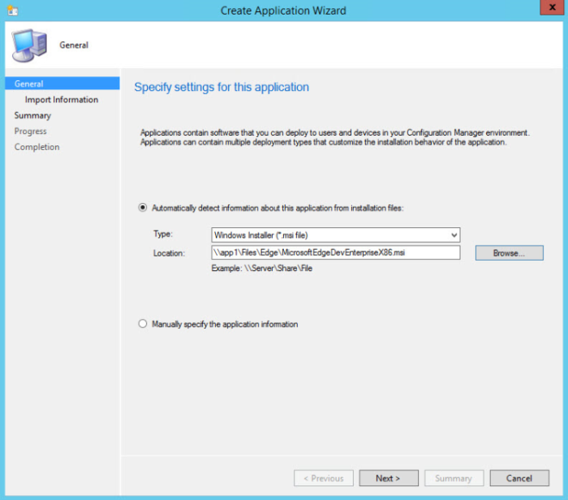

4. Click **Next**. On the **Import Information** page, you'll see some information about the app and any associated files that were imported to Configuration Manager. Once you are done, click **Next** again.  

    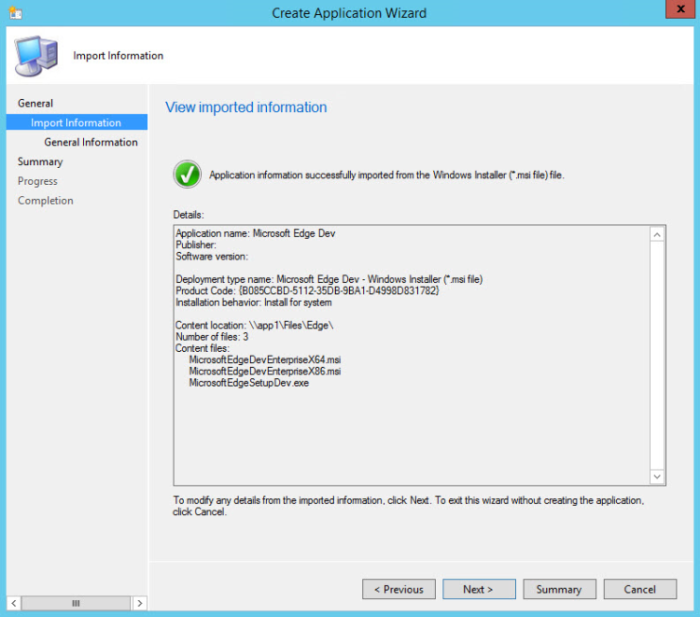

5. On the **General Information** page, you can supply further information about the application to help you sort and locate it in the Configuration Manager console.  

    Additionally, the **Installation program** field lets you specify the full command line that will be used to install the application on PCs. You can edit this to add your own properties (for example **/q** for an unattended installation).

   > [!TIP]  
   > Some of the fields on this page of the wizard will be filled in automatically when you import the application installation file.

    You'll end up with a screen that looks similar to the following screenshot:

    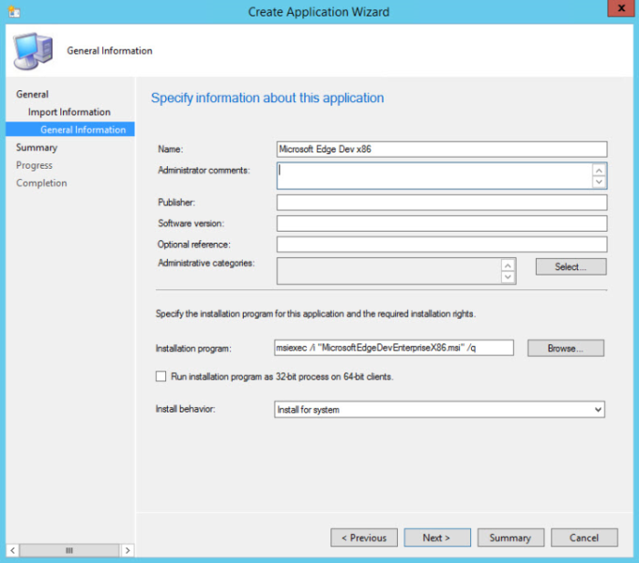

    You can add information about the application like so:

    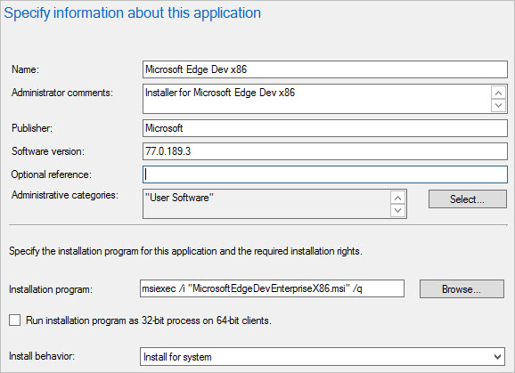

6. Click **Next**. On the Summary page, you can confirm your application settings and then complete the wizard.  

    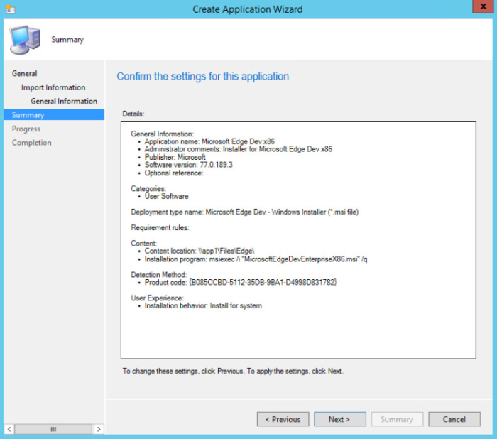

7. On the **Completion** page, click **Close**.

    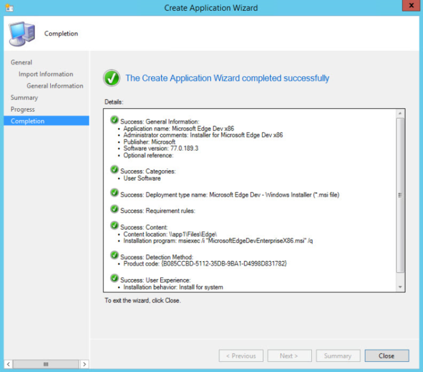

You've finished creating the app. To find it, in the **Software Library** workspace, expand **Application Management**, and then click **Applications**. For this example, you'll see:  

## Examine the properties of the application and its deployment type  

Now that you've created an application, you can refine the application settings if you need to. To look at the application properties, select the app, and then, in the **Home** tab in the **Properties** group, click **Properties**.  

   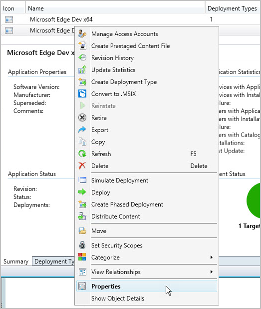

 In the **<application name\> Application Properties** dialog box, you'll see many items that you can configure to refine the behavior of the application. For details about all the settings you can configure, see [Create applications](https://docs.microsoft.com/en-us/sccm/apps/deploy-use/create-applications). For the purposes of this example, you'll just be changing some properties of the application's deployment type.  

 Click the **Deployment Types** tab > **application name** deployment type > **Edit**.

   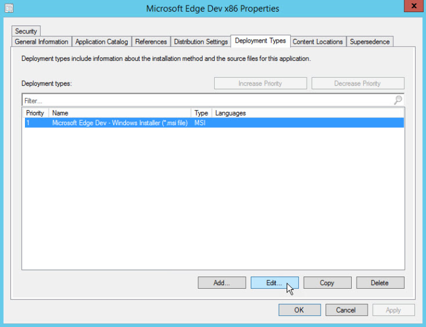

## Add a requirement to the deployment type  
 Requirements specify conditions that must be met before an application is installed on a device. You can choose from built-in requirements or you can create your own. For example, you can add a requirement that the application will only be installed on PCs that are running Windows 10 **x86** or **x64**, depending on the installation file's target processor architecture. In this example, you will specify Windows 10 **x86**.

1. From the deployment type properties page you just opened, click the **Requirements** tab.

2. Click **Add** to open the **Create Requirement** dialog box.

    

3. In the **Create Requirement** dialog box, specify the following information:

    - **Category**: **Device**  

    - **Condition**: **Operating system**  

    - **Rule type**: **Value**  

    - **Operator**: **One of**  

    - From the operating systems list, select **Windows 10** > **All Windows 10 (32-bit)**.  

    You'll end up with a dialog box that looks like this:

    

4. Click **OK** to close each property page that you opened. Then return to the **Applications** list in the Configuration Manager console.  

## Add the application content to a distribution point  

Next, to deploy the application to PCs, make sure that the application content is copied to a distribution point. PCs access the distribution point to install the application.  

> [!TIP]  
> To find out more about distribution points and content management in Configuration Manager, see [Deploy and manage content for System Center Configuration Manager](https://docs.microsoft.com/en-us/sccm/core/servers/deploy/configure/deploy-and-manage-content).  

1. In the Configuration Manager console, click **Software Library**.  

2. In the **Software Library** workspace, expand **Applications**. Then, in the list of applications, select the application that you created.

3. On the **Home** tab, in the **Deployment** group, click **Distribute Content**.  

4. On the **General** page of the **Distribute Content Wizard**, check that the application name is correct, and then click **Next**.  

5. On the **Content** page, review the information that will be copied to the distribution point, and then click **Next**.  

6. On the **Content Destination** page, click **Add** to select one or more collections, distribution points, or distribution point groups on which to install the application content.  

7. Complete the wizard.  

You can check that the application content was copied successfully to the distribution point from the **Monitoring** workspace, under **Distribution Status** > **Content Status**.  

## Deploy the application  

Next, deploy the application to a device collection in your hierarchy. In this example, you deploy the application to the **All Systems** device collection.  

> [!TIP]  
> Remember that only Windows 10 computers of the specified processor architecture will install the application because of the requirements that you selected earlier.  

1. In the Configuration Manager console, click **Software Library** > **Application Management** > **Applications**.

2. From the list of applications, select the application that you created earlier. Then, on the **Home** tab in the **Deployment** group, click **Deploy**, or right-click the application and select **Deploy**.

    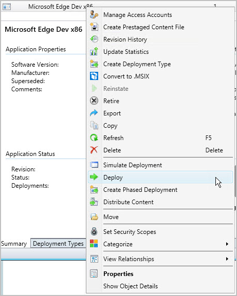

3. On the **General** page of the **Deploy Software Wizard**, click **Browse** to select the device collection to which you want to deploy the application.

    

4. On the **Content** page, check that the distribution point from which you want PCs to install the application is selected.

    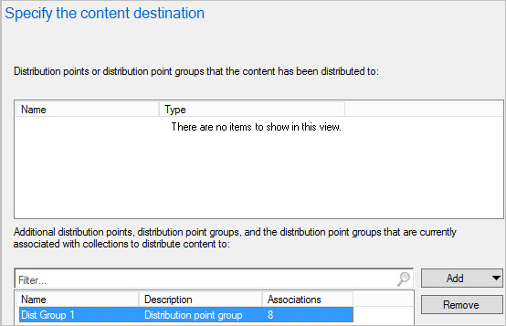

5. On the **Deployment Settings** page, make sure that the deployment action is set to **Install**, and the deployment purpose is set to **Required**.

    

    > [!TIP]  
    > By setting the deployment purpose to **Required**, you make sure that the application is installed on PCs that meet the requirements that you set. If you set this value to **Available**, then users can install the application on demand from Software Center.  

6. On the **Scheduling** page, you can configure when the application will be installed. For this example, select **As soon as possible after the available time**.

    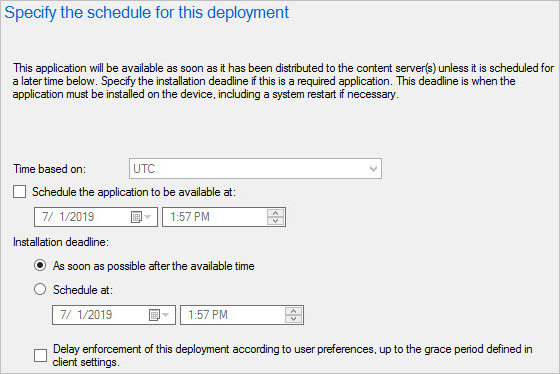

7. On the **User Experience** page, select your desired values and click **Next**.

    

8. Specify your desired alert options and click **Next**.

    

9. Complete the wizard.

Use the information in the following **Monitor the application** section to see the status of your application deployment.  

## Monitor the application  
 In this section, you'll take a quick look at the deployment status of the application that you just deployed.  

### To review the deployment status  

1. In the Configuration Manager console, click **Monitoring** > **Deployments**.  

2. From the list of deployments, select the application.

    

3. On the **Home** tab, in the **Deployment** group, click **View Status**.  

4. Select one of the following tabs to see more status updates about the application deployment:  

    - **Success**: The application installed successfully on the indicated PCs.  

    - **In Progress**: The application has not yet finished installing.  

    - **Error**: An error occurred installing the application on the indicated PCs. Further information about the error is also displayed.  

    - **Requirements Not Met**: No installation attempt was made on the indicated devices because they did not meet the requirements you configured (in this example, because they do not run on Windows 10).  

    - **Unknown**: Configuration Manager was unable to report the status of the deployment. Check back again later.  

> [!TIP]  
> There are a few ways you can monitor application deployments. For full details, see [Monitor applications](https://docs.microsoft.com/en-us/sccm/apps/deploy-use/monitor-applications-from-the-console).  

## End-user experience  

Users who have PCs that are managed by Configuration Manager and running Windows 10 of the specified processor architecture see a message telling them that they must install the Microsoft Edge Dev application. Once they accept the installation, the application gets installed.  

## See also

- [Overview of Microsoft Edge in the enterprise](overview-edge-in-the-enterprise.md)
- [Microsoft Edge Enterprise landing page](https://aka.ms/EdgeEnterprise)
- [Create and deploy an application with System Center Configuration Manager](https://docs.microsoft.com/sccm/apps/get-started/create-and-deploy-an-application)
