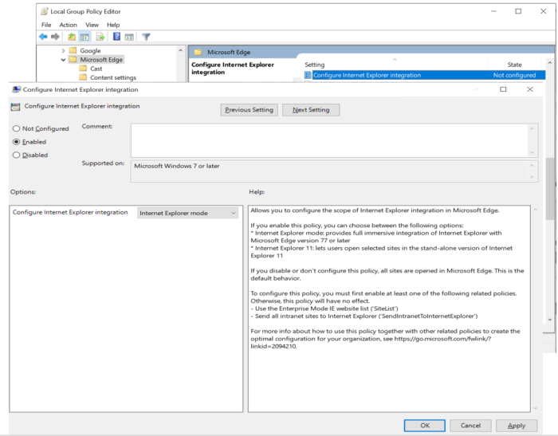
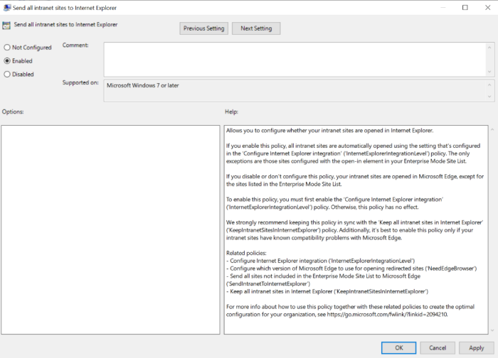
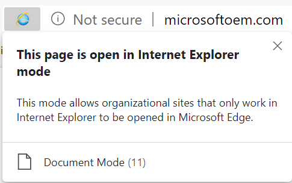

# Use Microsoft Edge with IE mode

> [!NOTE]
> This article applies to Microsoft Edge **Dev** Channel (Canary is not supported), version 77 or later


## Prerequisites:

- Windows 10 with the following minimum system requirements:
  - Windows 10, version 1903 with the latest cumulative updates ([KB4503293](https://support.microsoft.com/en-us/help/4503293) or higher) and security update [KB4501375](https://support.microsoft.com/en-us/help/4501375) or higher
  - Windows 10, version 1809 with latest cumulative update ([KB4509479](https://support.microsoft.com/en-us/help/4509479) or higher)

- Microsoft Edge administrative template available (See [Configure Microsoft Edge](https://docs.microsoft.com/en-us/DeployEdge/configure-microsoft-edge) for additional info)


## What is IE mode?

IE mode on Microsoft Edge is a simplified experience that combines a modern rendering engine and compatibility with legacy sites that require Internet Explorer in a single browser. IE mode provides an integrated browsing experience in Microsoft Edge, using the integrated Chromium engine for modern sites and leveraging Internet Explorer 11 (IE11) for legacy sites that require the Trident MSHTML engine.

IE mode is policy enabled and applies to:

- Sites listed in the **Use the Enterprise Mode IE website list** Internet Explorer group policy
- Intranet sites that have **Send all intranet sites to Internet Explorer** Microsoft Edge 77 or later group policy enabled

>[!NOTE]
> If you want to configure your Enterprise Mode Site List, see the [Use the Enterprise Mode Site List Manager](https://docs.microsoft.com/en-us/internet-explorer/ie11-deploy-guide/use-the-enterprise-mode-site-list-manager) and [Add multiple sites to the Enterprise Mode site list using a file and the Enterprise Mode Site List Manager (schema v.2)](https://docs.microsoft.com/en-us/internet-explorer/ie11-deploy-guide/add-multiple-sites-to-enterprise-mode-site-list-using-the-version-2-schema-and-enterprise-mode-tool) articles.

## IE mode supports the following Internet Explorer functionality:

- All document modes and enterprise modes.
- ActiveX controls
- Browser Helper Objects
- Internet Explorer settings and Group Policies that affect the security zone settings and Protected Mode
- F12 chooser
- (Limited functionality) Microsoft Edge extensions

## IE mode does not support the following Internet Explorer functionality:

- Internet Explorer toolbars
- Internet Explorer settings and Group Policies that affect the navigation menu (for example - search engines, home pages, etc.)
- IE11 or Microsoft Edge F12 developer tools

## Enable IE mode

The following steps walk through enabling IE mode.

### Enable IE mode using Group Policy

1. Open Local Group Policy Editor.
1. Click **Administrative Templates** > **Microsoft Edge**.
1. Double-click **Configure Internet Explorer integration**.
1. Select **Enabled**.
1. In the Options area, choose **IE mode**.

    

### Configure which sites should open in IE mode

#### If all intranet sites should be redirected to IE mode

> [!NOTE]
> - The group policy best applies for the user scenarios where we don't have a site list configured.
> - Sites listed in the Enterprise Site List XML will have higher priority.
> - We consider that most of the legacy sites are under the Local Intranet Zone.

1. Open Local Group Policy Editor.
1. Click **Administrative Templates** > **Microsoft Edge**.
1. Double-click **Send all intranet sites to Internet Explorer**.
1. Select **Enabled**.

    


#### If only sites configured using the Site List XML should be redirected to IE mode

> [!NOTE]
> Enterprise Mode schema v.1 will not be supported for IE mode integration. If you are using schema v.1, you must upgrade to schema v.2 or v.2.1. See [Enterprise Mode schema v.2 guidance](https://docs.microsoft.com/en-us/internet-explorer/ie11-deploy-guide/enterprise-mode-schema-version-2-guidance).
>
> If you're running version 2.0 (v.2) of the schema, you can continue to do so, but you won't get the additional functionality detailed in the updated schema attributes.

1. Create or re-use a Site List XML
    1. All sites that have the element _\<open-in\>IE11\</open-in\>_ will now open in IE mode.
1. Open Group Policy Editor.
1. Click **Administrative Templates** > **Windows Components** > **Internet Explorer**.
1. Double-click **Use the Enterprise Mode IE website list**.
1. Select **Enabled**.
1. In Options, specify the path to the Site List XML which can be:
    1. (Recommended) HTTPS location: **https://localhost:8080/sites.xml**
    1. Local network file: **\\\network\shares\sites.xml**
    1. Local file: **file:///c:/Users/<user>/Documents/sites.xml**


All of your managed devices must have access to this location if you want them to be able to access and use Enterprise Mode and your site list. For information about how to create and use an Enterprise Mode site list, see [Use the Enterprise Mode Site List Manager](https://docs.microsoft.com/en-us/internet-explorer/ie11-deploy-guide/use-the-enterprise-mode-site-list-manager).

#### Updated schema elements

The following table provides the additional element added to the v.2 of the Enterprise Mode schema:

| **Element** | **Description** |
| --- | --- |
| \<open-in app=**true**\> | A child element that controls what browser is used for sites. This element is required for sites that need to **open in IE11**.|

**Example:**

``` xml
<site url=contoso.com>

  <open-in app=true>IE11</open-in>

</site>
```

The following table shows the possible values of the \<open-in\> element:

| **Value** | **Description** |
| --- | --- |
| **\<open-in\>IE11\</open-in\>** | Opens the site in IE mode, regardless of which browser is opened by the employee. |
| **\<open-in app=**true**\>IE11\</open-in\>** | Opens the site in IE11, regardless of which browser is opened by the employee. |
| **\<open-in\>MSEdge\</open-in\>** | Opens the site in Microsoft Edge, regardless of which browser is opened by the employee. |
| **\<open-in\>None or not specified\</open-in\>** | Opens in whatever browser the employee chooses. |

> [!NOTE]
> The attribute app=**true** is only recognized when associated to _'open-in' IE11_. Adding it to the other 'open-in' elements won't change the behavior. We recommend following the structure mentioned above.

#### Additional configurations

If you have identified a site that needs to run in IE11, from business or technical reasons you can update the site list to set the specific website with the following structure.

``` xml
<site url=contoso.com>

  <open-in app=true>IE11</open-in>

</site>
```

If you want to restrict users from using IE11, do the following:

1. Open Local Group Policy Editor.
1. Click **Administrative Templates** > **Windows Components** > **Internet Explorer**.
1. Double-click **Send all sites not included in the Enterprise Mode Site List to Microsoft Edge**.
1. Select **Enabled**.

## Frequently Asked Questions

### How do I know if a site is loading in IE mode?

When a site loads in IE mode, the IE logo indicator displays on the left side of navigation bar. You can click the IE logo indicator to display additional information.

  

### Will IE mode replace Internet Explorer 11?

We're committed to keeping Internet Explorer a supported, reliable, and safe browser. Internet Explorer is still a component of Windows and follows the support lifecycle of the OS on which it's installed. For details, see [Lifecycle FAQ - Internet Explorer](https://support.microsoft.com/help/17454/). While we continue to support and update Internet Explorer, the latest features and platform updates will only be available in Microsoft Edge.

### Why am I receiving the following message “To open this page in IE mode, try updating your PC.”?

You are receiving the message because you are missing the required Windows updates. We recommend installing the latest updates. The minimum Windows updates are:
-	Windows 10, version 1903 with the latest cumulative updates (KB4503293 or higher) and security update KB4501375 or higher 
-	Windows 10, version 1809 with latest cumulative update (KB4509479 or higher)

### Why am I receiving the following message “To open this page in IE mode, try reinstalling Microsoft Edge with administrator privileges.”?

Microsoft Edge version 77 or later needs to be installed at system level. 

Possible reasons: 
- Microsoft Edge Canary is installed at per user level and doesn’t prompt for elevation
- Microsoft Edge Dev, Beta will prompt for elevation but if you cancel the elevation the installation will be continue at user level 
Possible solutions: 
- Run the installer for any channels at system level: installer.exe --system-level 

### Why am I receiving the following message “To open this page in IE mode, try restarting Microsoft Edge.”? 

You are receiving this message because there was an unexpected error encountered within the Internet Explorer process which should be resolved by restarting Microsoft Edge.

### Why am I receiving the following message “Turn off remote debugging to open this site in IE mode otherwise it might not work as expected.”

You are receiving the message because you have started remote debugging and you have navigated to a web page that your organization has configured to run in IE mode. 

If the intention is to run remote debug on this page you can continue to do so, but the webpage will be rendered in the Microsoft Edge engine. 

## See also

- [Overview of Microsoft Edge in the enterprise](overview-edge-in-the-enterprise.md)
- [Microsoft Edge Enterprise landing page](https://aka.ms/EdgeEnterprise)
- [Additional Enterprise Mode info](https://docs.microsoft.com/en-us/internet-explorer/ie11-deploy-guide/enterprise-mode-overview-for-ie11)
