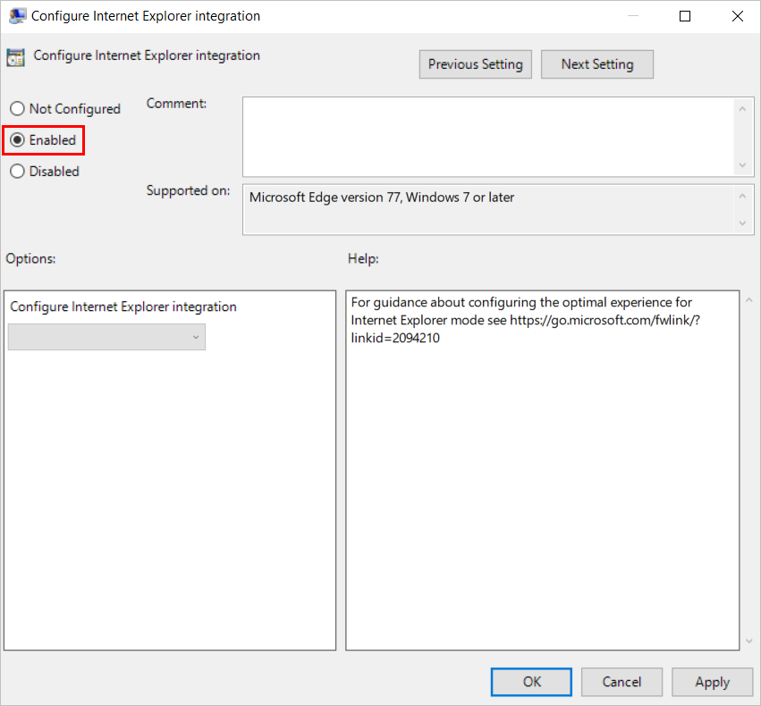
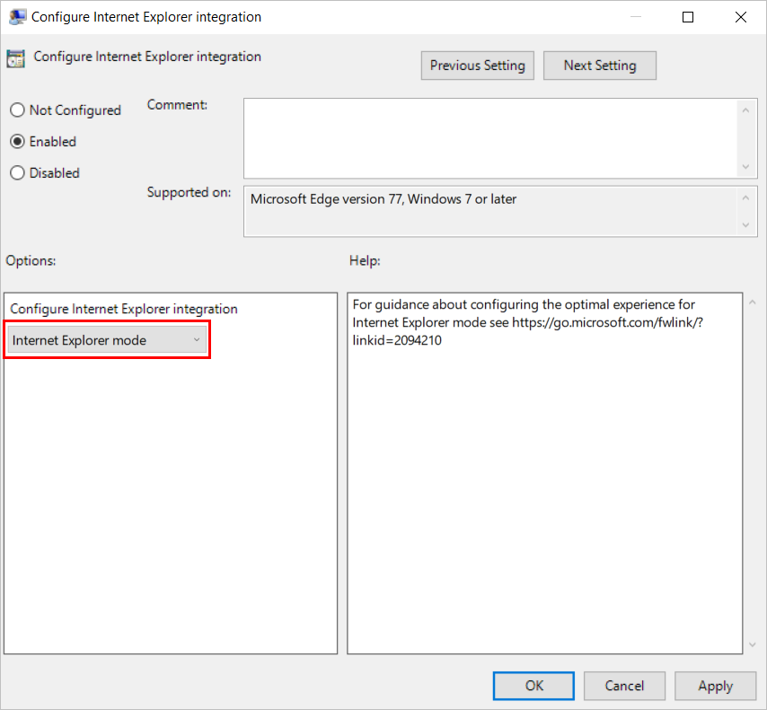
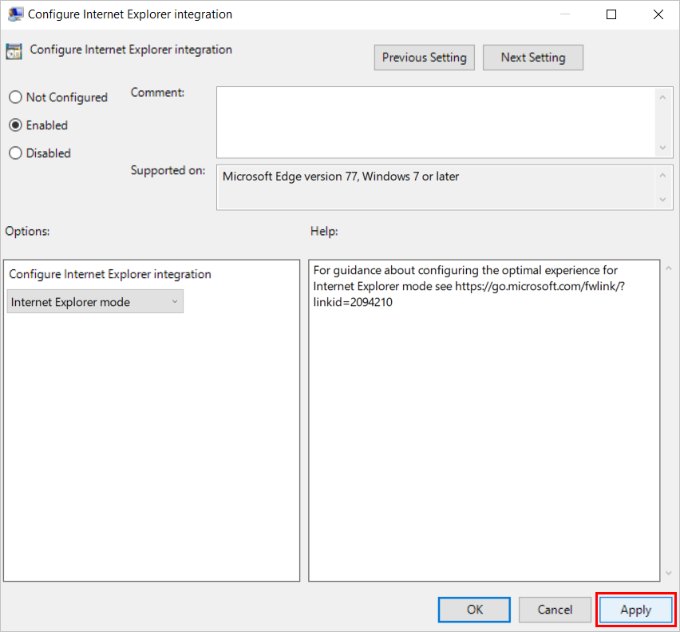
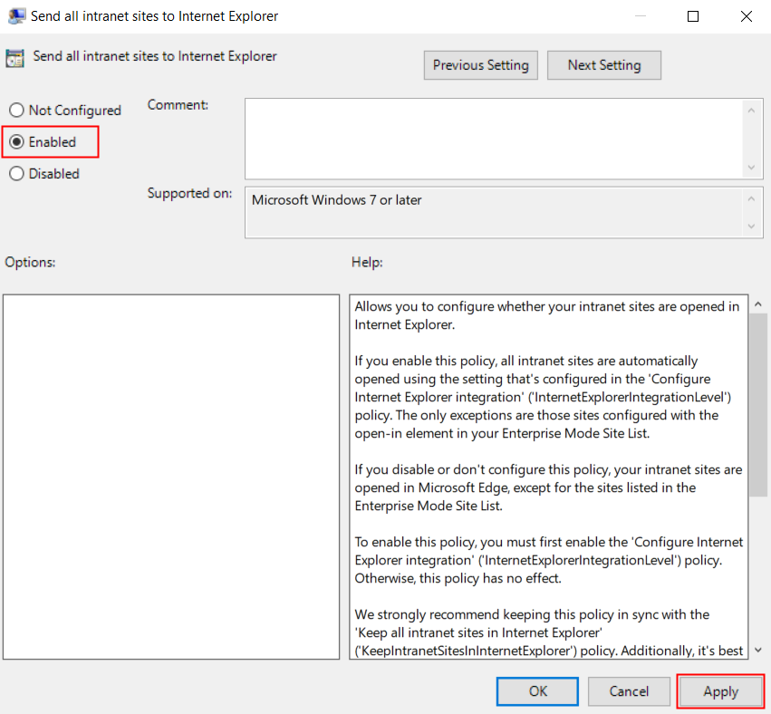
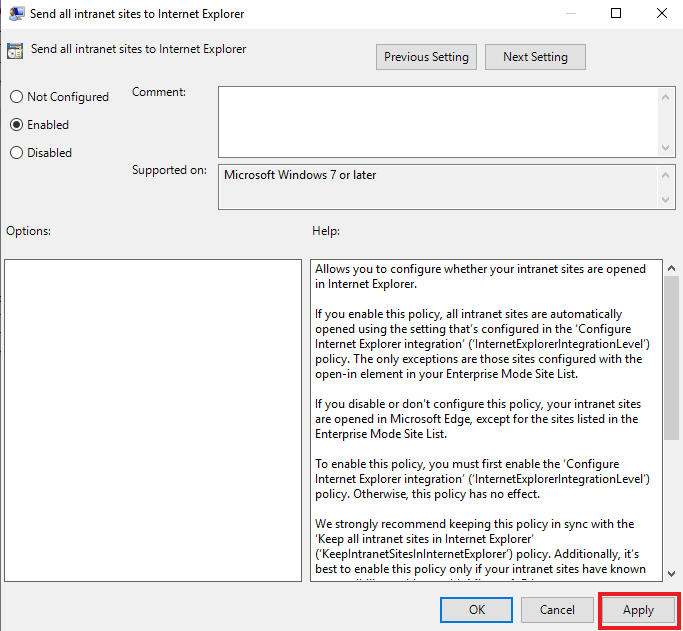
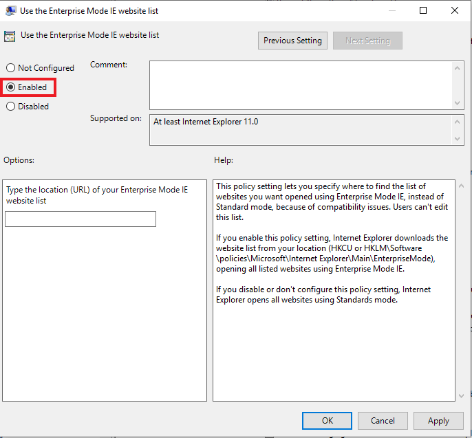
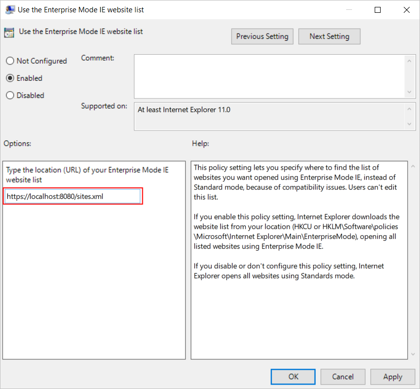
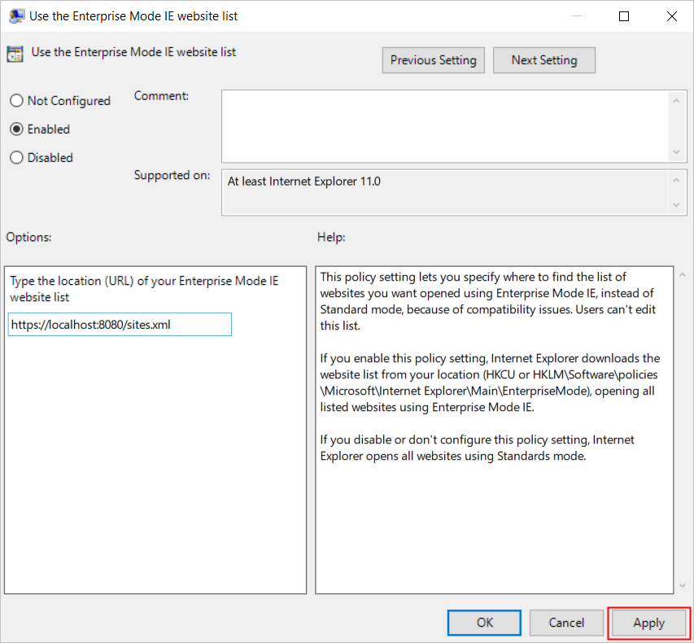
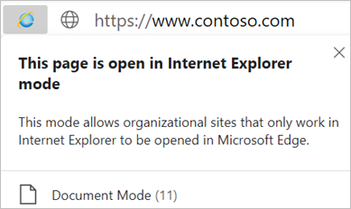
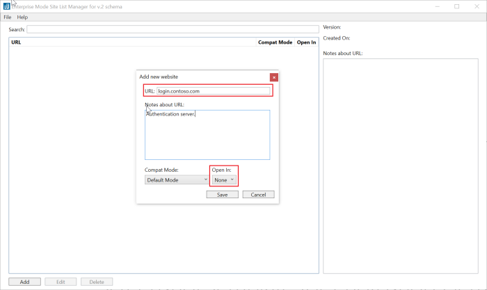

# Use Microsoft Edge with IE mode

This article explains how  to use Microsoft Edge with IE mode.

>[!NOTE]
>This article applies to Microsoft Edge **Dev** Channel, version 77 or later.

## Prerequisites

- Windows 10 with the following minimum system requirements:
  - Windows 10, version 1903 with the latest cumulative updates ([KB4503293](https://support.microsoft.com/help/4503293) or higher) and security update [KB4501375](https://support.microsoft.com/help/4501375) or higher
  - Windows 10, version 1809 with latest cumulative update ([KB4509479](https://support.microsoft.com/help/4509479) or higher)
- Windows 8.1 and Windows Server 2012 R2 with the latest SSU ([KB4504418](https://support.microsoft.com/help/4504418/servicing-stack-update-kb4504418) or higher) and [KB4507463](https://support.microsoft.com/help/4507463/july-16-2019-kb4507463-os-build-preview-of-monthly-rollup) or higher
- Windows 8 Embedded and Windows Server 2012:
  - Install [KB4492872](https://support.microsoft.com/help/4492872/update-for-internet-explorer-april-16-2019) to upgrade to Internet Explorer 11
  - Install latest IE11 cumulative updates [KB4510979](https://support.microsoft.com/help/4510979/cumulative-update-for-internet-explorer) or higher
- Windows 7 SP1 and Windows Server 2008R2 with the latest SSU ([KB4490628](https://support.microsoft.com/help/4490628/servicing-stack-update-for-windows-7-sp1-and-windows-server-2008-r2) or higher) and [KB4507437](https://support.microsoft.com/help/4507437/windows-7-update-kb4507437) or higher
  
- Microsoft Edge administrative template available (See [Configure Microsoft Edge](https://docs.microsoft.com/DeployEdge/configure-microsoft-edge) for additional info)

  > [!NOTE]
  > IE mode will be supported on Windows versions that support IE11. IE mode will soon be available on Windows 10 versions 1803, 1709, 1607 and 1507.

## What is IE mode?

IE mode on Microsoft Edge is a simplified experience that combines a modern rendering engine and compatibility with legacy sites that require Internet Explorer in a single browser. IE mode provides an integrated browsing experience in Microsoft Edge, using the integrated Chromium engine for modern sites and leveraging Internet Explorer 11 (IE11) for legacy sites that require the Trident MSHTML engine.

IE mode is policy enabled and applies to:

- Sites listed in the **Use the Enterprise Mode IE website list** Internet Explorer group policy
- Intranet sites that have **Send all intranet sites to Internet Explorer** Microsoft Edge 77 or later group policy enabled

### IE mode supports the following Internet Explorer functionality

- All document modes and enterprise modes.
- ActiveX controls
- Browser Helper Objects
- Internet Explorer settings and Group Policies that affect the security zone settings and Protected Mode
- F12 chooser
- (Limited functionality) Microsoft Edge extensions

### IE mode doesn't support the following Internet Explorer functionality

- Internet Explorer toolbars
- Internet Explorer settings and Group Policies that affect the navigation menu (for example - search engines, and home pages.)
- IE11 or Microsoft Edge F12 developer tools

## Enable IE mode

Use the following steps to enable IE mode.

### Enable IE mode using Group Policy

1. Download and use the latest [Microsoft Edge Policy Template](https://docs.microsoft.com/DeployEdge/configure-microsoft-edge).
2. Open Local Group Policy Editor.
3. Click **Computer Configuration** > **Administrative Templates** > **Microsoft Edge**.
4. Double-click **Configure Internet Explorer integration**.

    

5. Select **Enabled**.

    

6. Under **Options**, select **Internet Explorer mode** from the dropdown list.

    

7. Click **OK** or **Apply** to save this policy setting.

<!--
    -->

### Configure the sites should open in IE mode

There are 2 options for determining which sites should open in IE mode:

- All intranet sites should open in IE mode.
- Sites on the Enterprise Site List XML should open in IE mode.

#### To configure all intranet sites to open in IE mode

>[!NOTE]
>
>- This group policy may be most appropriate for an organization that does not currently deploy a custom site list but requires IE11 for the majority of its intranet sites.
> - This policy will be most effective when most of an organization’s legacy sites are in the Local Intranet Zone”.
> - If you also deploy a custom site list, the configuration in the site list take precedence over this policy.
>

1. Open Local Group Policy Editor.
2. Click **Computer Configuration** > **Administrative Templates** > **Microsoft Edge**.
3. Double-click **Send all intranet sites to Internet Explorer**.

    

4. Select **Enabled**, and then click **OK** or **Apply** to save the policy settings.

    

<!--
5. Click **Apply**.

     -->

#### To use a Site List to configure specific sites to open in IE mode

>[!NOTE]
>Enterprise Mode schema v.1 isn't supported for IE mode integration. If you are currently using schema v.1 with Internet Explorer 11, you must upgrade to schema v.2 or v.2.1. For more information, see [Enterprise Mode schema v.2 guidance](https://docs.microsoft.com/internet-explorer/ie11-deploy-guide/enterprise-mode-schema-version-2-guidance).

1. Create or re-use a Site List XML
    1. All sites that have the element _\<open-in\>IE11\</open-in\>_ will now open in IE mode.
2. Open Group Policy Editor.
3. Click **Computer Configuration** > **Administrative Templates** > **Windows Components** > **Internet Explorer**.
4. Double-click **Use the Enterprise Mode IE website list**.

    

5. Select **Enabled**.

    

6. Under **Options**, type the location of website list. You can use one of the following locations:

    - (Recommended) HTTPS location: **https://localhost:8080/sites.xml**
    - Local network file: **\\\network\shares\sites.xml**
    - Local file: **file:///c:/Users/\<user\>/Documents/sites.xml**

    

7. Click **OK** or **Apply** to save these settings.

    

>[!NOTE]
> The following articles give more information about creating the Enterprise Mode Site List:
>
>- [Use the Enterprise Mode Site List Manager](https://docs.microsoft.com/internet-explorer/ie11-deploy-guide/use-the-enterprise-mode-site-list-manager)
>- [Add multiple sites to the Enterprise Mode site list using a file and the Enterprise Mode Site List Manager (schema v.2)](https://docs.microsoft.com/internet-explorer/ie11-deploy-guide/add-multiple-sites-to-enterprise-mode-site-list-using-the-version-2-schema-and-enterprise-mode-tool).

#### Updated schema elements

The following table describes the \<open-in app\> element added to the v.2 of the Enterprise Mode schema:

| **Element** | **Description** |
| --- | --- |
| \<open-in app="**true**"\> | A child element that controls what browser is used for sites. This element is required for sites that need to **open in IE11**.|

**Example:**

``` xml
<site url="contoso.com">

  <open-in app="true">IE11</open-in>

</site>
```

The following table shows the possible values of the \<open-in\> element:

| **Value** | **Description** |
| --- | --- |
| **\<open-in\>IE11\</open-in\>** | Opens the site in IE mode, regardless of which browser is opened by the employee. |
| **\<open-in app="**true**"\>IE11\</open-in\>** | Opens the site in IE11, regardless of which browser is opened by the employee. |
| **\<open-in\>MSEdge\</open-in\>** | Opens the site in Microsoft Edge, regardless of which browser is opened by the employee. |
| **\<open-in\>None or not specified\</open-in\>** | Opens in whatever browser the employee chooses. |

>[!NOTE]
> The attribute app=**"true"** is only recognized when associated to _'open-in' IE11_. Adding it to the other 'open-in' elements won't change browser behavior.

#### Additional configurations

If you have identified a site that needs to run in IE11, from business or technical reasons you can update the site list to set the specific website with the following structure.

``` xml
<site url="contoso.com">

  <open-in app="true">IE11</open-in>

</site>
```

To prevent users from using IE11, follow these steps:

1. Open Local Group Policy Editor.
2. Click **Administrative Templates** > **Windows Components** > **Internet Explorer**.
3. Double-click **Send all sites not included in the Enterprise Mode Site List to Microsoft Edge**.
4. Select **Enabled**.

## Frequently Asked Questions

### How do I know if a site is loading in IE mode?

When a site loads in IE mode, the IE logo indicator displays on the left side of navigation bar. You can click the IE logo indicator to display additional information.

  

### Will IE mode replace Internet Explorer 11?

We're committed to keeping Internet Explorer a supported, reliable, and safe browser. Internet Explorer is still a component of Windows and follows the support lifecycle of the OS on which it's installed. For details, see [Lifecycle FAQ - Internet Explorer](https://support.microsoft.com/help/17454/). While Microsoft continues to support and update Internet Explorer, the latest features and platform updates will only be available in Microsoft Edge.

### Why am I receiving the following message “To open this page in IE mode, try updating your PC.”?

You are receiving the message because you are missing the required Windows updates. The minimum Windows required updates are:

- Windows 10, version 1903 with the latest cumulative updates (KB4503293 or higher) and security update KB4501375 or higher.
- Windows 10, version 1809 with latest cumulative update (KB4509479 or higher.)

### Why am I receiving the following message “To open this page in IE mode, try reinstalling Microsoft Edge with administrator privileges.”?

Microsoft Edge version 77 or later needs to be installed at the system level.

Possible reasons for this error:

- Microsoft Edge Canary is installed at the user level and doesn’t prompt for elevation.
- Microsoft Edge Dev, Beta will prompt for elevation but if you cancel the elevation, the installation will be continue at the user level.

Possible solutions:

- Run the installer for any channel at the system level: `installer.exe --system-level`.

To check that Microsoft Edge is installed at the systems level, type "edge://version" in the Microsoft Edge address bar. The Executable path will show a path starting with *C:\Program Files...*, which indicates a system install. If the Executable path begins with *C:\Users..*, uninstall and then reinstall Microsoft Edge with administrator privileges.

### Why am I receiving the following message “To open this page in IE mode, try restarting Microsoft Edge.”?

You're receiving this message because there was an unexpected error encountered in the Internet Explorer process. This should be resolved by restarting Microsoft Edge.

### Why am I receiving the following message “Turn off remote debugging to open this site in IE mode otherwise it might not work as expected.”

You're receiving the message because you started remote debugging and you navigated to a web page that your organization has configured to run in IE mode.

If the intention is to run remote debug on this page you can continue to do so, but the webpage will be rendered in the Microsoft Edge engine.

### I am trying to go to a site in IE mode, and it appears to be stuck navigating in a loop or tells me that I’m not authenticated. What's happening?

This is probably happening because the site you are trying to reach is redirecting to an authentication server that's not configured to open in IE mode. You can try opening the site in standalone IE11 with Developer Tools open to see the identity of the authentication server.

The solution is to configure the authentication server in your Enterprise site list as “neutral”. You can do this using the Enterprise Mode Site List Manager or directly in the sitelist XML.

- Through the Enterprise Mode Site List Manager:

  

- Directly within the sitelist XML:

``` xml
<site url="login.contoso.com">
  <compat-mode>Default</compat-mode>
  <open-in app="true">None</open-in>
</site>
```

## See also

- [Overview of Microsoft Edge in the enterprise](overview-edge-in-the-enterprise.md)
- [Microsoft Edge Enterprise landing page](https://aka.ms/EdgeEnterprise)
- [Additional Enterprise Mode info](https://docs.microsoft.com/internet-explorer/ie11-deploy-guide/enterprise-mode-overview-for-ie11)
