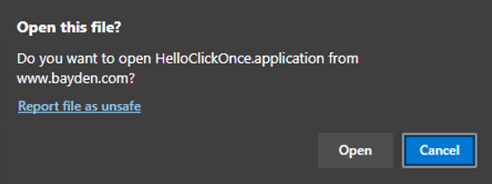
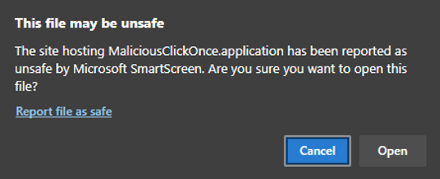

# Understand the ClickOnce and DirectInvoke features in Microsoft Edge

ClickOnce and DirectInvoke are features available in IE and Microsoft Edge (EdgeHTML) that support the use of a file handler to download files from a website. Although they serve different purposes, both features let websites specify that a file requested for download is passed to a file handler on the user’s device. ClickOnce requests are handled by the native file handler in Windows. DirectInvoke requests are handled by a registered file handler specified by the website hosting the file.

For more information about these features, see:
- [ClickOnce](https://docs.microsoft.com/en-us/visualstudio/deployment/clickonce-security-and-deployment?view=vs-2019)
- [DirectInvoke]( https://technet.microsoft.com/en-us/learning/jj215788(v=vs.94).aspx)

> [!NOTE]
> Currently, Chromium doesn't provide native support for ClickOnce or DirectInvoke.

## Overview: prerequisites and process

For ClickOnce and DirectInvoke to work as designed and for the file handler to be successfully requested, the file handler must be registered to the operating system as supporting ClickOnce or DirectInvoke. This registration typically happens when the original operating system is installed or when a new program that’s installed requests the ability to use DirectInvoke for updates.

When a website receives a download request that requires ClickOnce or DirectInvoke, the following actions happen:

- The website requests that the browser use a specified file handler.
- The browser checks the operating system registry to see if the file handler is registered for the requested file type.
- If the file handler is registered, the browser calls the file handler and passes the URL as an argument to the file handler.
- The file handler processes the URL and downloads the file.

  > [!NOTE]
  > The URL is used to determine the source of the file, as well as any parameters to use when accessing the file.  For example: endpoints, a manifest, or metadata.

## Use cases

The following use cases are representative.

You can use ClickOnce to easily deploy and update software on devices with minimal user interaction. Users can install and run a Windows-based application by clicking a link in a web page. If configured correctly, the ClickOnce application can install programs without having users set configurations for the installer. For example, file locations, what options to install, and so on.

DirectInvoke use cases depend on the intent of the website requesting DirectInvoke. For example, the collaborative file-editing feature of Microsoft Word. Instead of clicking a link and downloading the entire copy of a document you’re working on with your colleagues, DirectInvoke lets you download the parts of the document that have been changed. This reduces the amount of data transferred and can reduce the time needed to open the document.  

## Current support for ClickOnce and DirectInvoke in Microsoft Edge

Support for ClickOnce and DirectInvoke:

- DirectInvoke is supported out of the box for all Windows users but ClickOnce is disabled for all Windows users.

  > [!NOTE]
  > Users that need ClickOnce support can go to edge://flags. Scroll to **ClickOnce Support** and select **Enable** from the dropdown list.

- ClickOnce and DirectInvoke aren’t supported on any platforms other than Windows.
- Because ClickOnce is an enterprise-focused feature that’s used by a specific group of power users and not intended for general use, ClickOnce is disabled by default.

## ClickOnce and DirectInvoke file handling security

ClickOnce and DirectInvoke are protected by Microsoft Defender SmartScreen’s URL reputation scanning service.

If a ClickOnce or a DirectInvoke request was is flagged by the Microsoft Defender SmartScreen URL reputation service as unsafe, users with ClickOnce or DirectInvoke enabled will see two popups.

The first popup asks the user if they want to open the file. This popup is displayed regardless of whether the file was flagged as safe or unsafe. The user can **Report the file as unsafe**, **Cancel** the request, or click **Open** to continue.

   

If the user tries to open the file, and the file was flagged as unsafe, a second popup is displayed.  This popup warns the user that the file was flagged as unsafe, and asks them if they’re sure they want to download the file.

The second popup only shows up if:

- the file is a ClickOnce or DirectInvoke file
- ClickOnce or DirectInvoke are enabled
- the file is flagged as unsafe

 

> [!NOTE]
> If ClickOnce or DirectInvoke are disabled, requested files are treated as regular downloads and if flagged as unsafe, will be marked as unsafe. This is consistent with the treatment of other unsafe downloads.

## ClickOnce and DirectInvoke policies

There are 2 group policies that you can use to enable or disable ClickOnce and DirectInvoke for enterprise users. These two policies are [ClickOnceEnabled](https://docs.microsoft.com/DeployEdge/microsoft-edge-policies#clickonceenabled) and [DirectInvokeEnabled](https://docs.microsoft.com/DeployEdge/microsoft-edge-policies#directinvokeenabled).

## ClickOnce and DirectInvoke behavior

abcd

### ClickOnce enabled

abcd

### ClickOnce disabled

abcd

### DirectInvoke enabled

abcd

### DirectInvoke disabled

abcd

## See also

- [ClickOnce security and deployment](https://go.microsoft.com/fwlink/?linkid=2099880)
- [DirectInvoke in Internet Explorer](https://go.microsoft.com/fwlink/?linkid=2099871)
