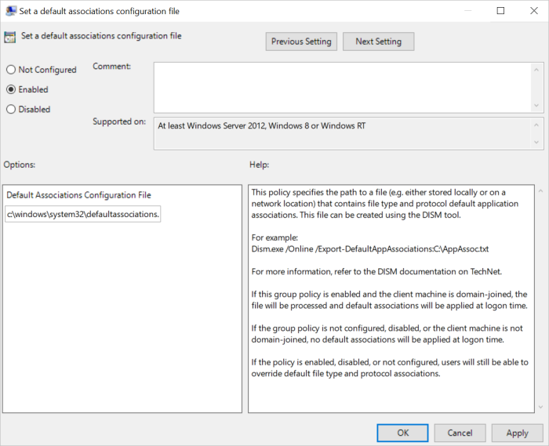

# Make Microsoft Edge the default browser

This article explains how you can make Microsoft Edge your default browser.

>[!NOTE]
>This article applies to Microsoft Edge version 77 or later.

## Introduction

You can use the **Set a default associations configuration file** Group Policy or the [DefaultAssociationsConfiguration](https://docs.microsoft.com/windows/client-management/mdm/policy-csp-applicationdefaults#applicationdefaults-defaultassociationsconfiguration) Mobile Device Management setting to make Microsoft Edge the default browser for your organization.

The default application association configuration file is an XML file that associates a file type with an application. For example, you can associate .html files with Microsoft Edge to launch Microsoft Edge each time the user opens an html file.

For managed devices, create a single shared XML file that identifies Microsoft Edge as the default browser. This file must be stored in a shared folder that's accessible by all your managed devices.

>[!NOTE]
>If Microsoft Edge isn't installed on the target device, the file associations aren't applied. Users must choose an application when they open a link (http or https) or a file (html or htm).

## Set Microsoft Edge as the default application

The following example shows how to set Microsoft Edge as the default browser to open html/htm files and http/https links.

```xml
<?xml version="1.0" encoding="UTF-8"?>
<DefaultAssociations>
  <Association Identifier=".htm" ProgId="MSEdgeSSHTM" ApplicationName="Microsoft Edge" />
  <Association Identifier=".html" ProgId="MSEdgeSSHTM" ApplicationName=" Microsoft Edge" />
  <Association Identifier="http" ProgId="MSEdgeSSHTM" ApplicationName=" Microsoft Edge" />
  <Association Identifier="https" ProgId="MSEdgeSSHTM" ApplicationName=" Microsoft Edge" />
</DefaultAssociations>

```

>[!NOTE]
>The default association policy is set at each login. The user can change an association after they login, but the change applies to that login session only. The association is reset to the policy at the next login.

## Set Microsoft Edge as the default browser on domain-joined devices

You can set Microsoft Edge as the default browser on domain-joined devices by configuring the **Set a default associations configuration file** Group Policy. Turning this Group Policy on requires you to create and store a default associations configuration file. This file is stored locally or on a network share. For more information about creating this file, see [Export or Import Default Application Associations](https://go.microsoft.com/fwlink/p/?LinkId=618268).

### To configure the Group Policy

1. Open the Group Policy editor and go to the **Computer Configuration\Administrative Templates\Windows Components\File Explorer**.
2. Select **Set a default associations configuration file**.
3. Click **policy setting**, and then under **Options:**, type the location to your default associations configuration file.

   

If this setting is enabled and the user's device is domain-joined, the file is processed, and default associations are applied at logon. If this setting isn't configured or is turned off, or if the user's device isn't domain-joined, no associations are applied at logon.

>[!NOTE]
>The default association policy is set at each login. Users can change an association after they login from the **Set Default Programs** area of the Control Panel, but the change only applies to that login session. The association is reset to the policy at the next login.

## Set Microsoft Edge as the default browser on Azure Active Directory joined devices

To set Microsoft Edge as the default browser on Azure Active Directory joined devices follow the steps in the **DefaultAssociationsConfiguration** Mobile Device Management setting using the following application association file example.

```xml
<?xml version="1.0" encoding="UTF-8"?>
<DefaultAssociations>
  <Association Identifier=".htm" ProgId="MSEdgeSSHTM" ApplicationName="Microsoft Edge" />
  <Association Identifier=".html" ProgId="MSEdgeSSHTM" ApplicationName=" Microsoft Edge" />
  <Association Identifier="http" ProgId="MSEdgeSSHTM" ApplicationName=" Microsoft Edge" />
  <Association Identifier="https" ProgId="MSEdgeSSHTM" ApplicationName=" Microsoft Edge" />
</DefaultAssociations>

```

>[!NOTE]
>After the setting is downloaded and applied, the computer must be rebooted for the setting to take effect.

## See also

[Export or Import Default Application Associations](https://docs.microsoft.com/previous-versions/windows/it-pro/windows-8.1-and-8/hh825038(v=win.10))
