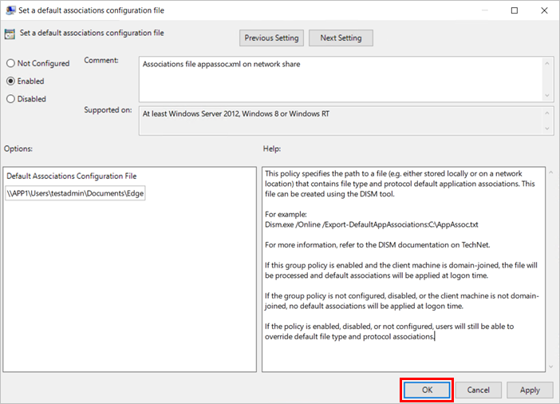

# How to make Microsoft Edge your default browser

This article explains how you can make Microsoft Edge the default browser for your organization.

> [!NOTE]
> This article applies to Microsoft Edge version 77 or later.

## Introduction

You can use the **Set a default associations configuration file** Group Policy or the [DefaultAssociationsConfiguration](https://docs.microsoft.com/windows/client-management/mdm/policy-csp-applicationdefaults#applicationdefaults-defaultassociationsconfiguration) Mobile Device Management setting to make Microsoft Edge the default browser for your organization.

> [!NOTE]
> If Microsoft Edge isn't installed on the target device, the file associations aren't applied. Users must choose an application when they open a link (http or https) or a file (html or htm).

To set Microsoft Edge Beta as the default browser for html files and http/https links use the following application association file example.

```xml
<?xml version="1.0" encoding="UTF-8"?>
<DefaultAssociations>
  <Association ApplicationName="Microsoft Edge Beta" ProgId="MSEdgeBHTML" Identifier=".html"/>
  <Association ApplicationName="Microsoft Edge Beta" ProgId="MSEdgeBHTML" Identifier="http"/>
  <Association ApplicationName="Microsoft Edge Beta" ProgId="MSEdgeBHTML" Identifier="https"/>  
</DefaultAssociations>
```

>[!NOTE]
>To set Microsoft Edge Dev as the default, set **ApplicationName** to "Microsoft Edge Dev" and ProgId to "MSEdgeDHTML"

## Set Microsoft Edge as the default browser on domain-joined devices

You can set Microsoft Edge as the default browser on domain-joined devices by configuring the **Set a default associations configuration file** group policy. Turning this group policy on requires you to create and store a default associations configuration file. This file is stored locally or on a network share. For more information about creating this file, see [Export or Import Default Application Associations](https://go.microsoft.com/fwlink/p/?LinkId=618268).

### To configure the group policy for a default file type and protocol associations configuration file:

1. Open the Group Policy editor and go to the **Computer Configuration\Administrative Templates\Windows Components\File Explorer**.
2. Select **Set a default associations configuration file**.
3. Click **policy setting**, and then click **Enabled**.
4. Under **Options:**, type the location to your default associations configuration file.
5. Click **OK** to save the policy settings.

The example in the next  screenshot shows a file named *appassoc.xml* on a network share.

   

   > [!NOTE]
   > If this setting is enabled and the user's device is domain-joined, the file is processed, and default associations are applied at logon. If this setting isn't configured or is turned off, or if the user's device isn't domain-joined, no associations are applied at logon.

## Set Microsoft Edge as the default browser on Azure Active Directory joined devices

To set Microsoft Edge Beta as the default browser on Azure Active Directory joined devices follow the steps in the [DefaultAssociationsConfiguration](https://docs.microsoft.com/windows/client-management/mdm/policy-csp-applicationdefaults#applicationdefaults-defaultassociationsconfiguration) Mobile Device Management setting using the following application association file example.

```xml
<?xml version="1.0" encoding="UTF-8"?>
<DefaultAssociations>
  <Association ApplicationName="Microsoft Edge Beta" ProgId="MSEdgeBHTML" Identifier=".html"/>
  <Association ApplicationName="Microsoft Edge Beta" ProgId="MSEdgeBHTML" Identifier="http"/>
  <Association ApplicationName="Microsoft Edge Beta" ProgId="MSEdgeBHTML" Identifier="https"/>  
</DefaultAssociations>
```

>[!NOTE]
>To set Microsoft Edge Dev as the default, set **ApplicationName** to "Microsoft Edge Dev" and ProgId to "MSEdgeDHTML"

## See also

- [Export or Import Default Application Associations](https://docs.microsoft.com/previous-versions/windows/it-pro/windows-8.1-and-8/hh825038(v=win.10))

> [!NOTE]
> Portions of this page are modifications based on work created and shared by Chromium.org and used according to terms described in the [Creative Commons Attribution 4.0 International License](http://creativecommons.org/licenses/by/4.0/). The original page can be found [here](https://www.chromium.org/developers/design-documents/network-settings#TOC-Command-line-options-for-proxy-sett).
  
<a rel="license" href="http://creativecommons.org/licenses/by/4.0/"></a><br/>This work is licensed under a <a rel="license" href="http://creativecommons.org/licenses/by/4.0/">Creative Commons Attribution 4.0 International License</a>.
